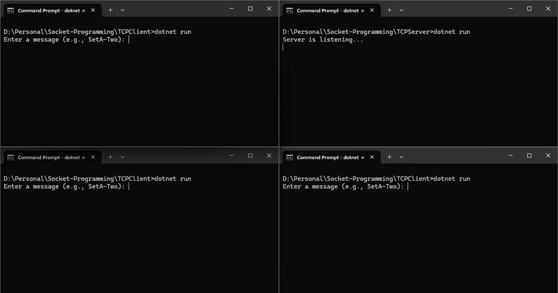

# Socket-Programming

[](./LICENSE)
[](https://github.com/your-username/tcp-client-server)
[](https://dotnet.microsoft.com/download/dotnet/8.0)

This is a **TCP Client-Server** application implemented using **.NET Console** which demonstrates Socket-Programming. The application demonstrates real-time communication between a client and server over TCP, supporting asynchronous client sessions. The project also includes encryption and decryption of messages exchanged between the client and the server.

## 🔭 Overview

This project consists of two parts:

- **TCP Client**: A client application that sends requests to the server and processes the responses.
- **TCP Server**: A server application that listens for incoming client connections, processes their requests, and sends appropriate responses.

Additionally, the server is capable of handling multiple client connections simultaneously, and all communication between the client and server is encrypted to ensure secure data transfer.

## 🌟 Features

- **TCP Communication**: Client and server communicate using **TCP sockets**.
- **Asynchronous Server**: The server is designed to handle **multiple client connections asynchronously**.
- **Encryption/Decryption**: Messages exchanged between the client and server are encrypted before transmission and decrypted upon receipt. The encryption method is configurable and can be adapted to the user's preference.
- **Real-time Data**: The server responds with the current system time, based on a value derived from the client's request.

## ❓ Prerequisites
- .NET SDK (version 6.0 or later) installed on your machine.
- Basic understanding of TCP Socket Programming and Encryption.

## 🧬 Project Structure

This project is split into two .NET Console Applications:

1. **TCPClient**: The client application that sends requests and processes responses from the server.
2. **TCPServer**: The server application that listens for client requests, processes them, and responds.

## ▶️ How to Run the Project

1. **Clone the repository**:
   ```bash
   git clone https://github.com/your-username/tcp-client-server.git
   ```

2. **Navigate to the TCPServer directory**:
    ```bash
    cd tcp-client-server/TCPServer
    ```

3. **Build and run the server**:
    ```bash
    dotnet build
    dotnet run
    ```

4. **Navigate to the TCPClient directory in another terminal (or open a new terminal window)**:
    ```bash
    cd tcp-client-server/TCPClient
    ```

5. **Build and run the client**:
    ```bash
    dotnet build
    dotnet run
    ```
You can open multiple instances of the TCP Client to simulate several client sessions communicating with the server.

## ⚒️ How It Works

### Communication Flow

1. The **TCP Client** sends a request to the **TCP Server**. The request is a string in the format: `Set<SetName>-<KeyName>`.
   
2. Upon receiving the request, the **TCP Server** checks if the `SetName` exists in a predefined collection of data. If it does:
    - It retrieves the corresponding subset.
    - It checks if the `KeyName` exists in the subset.
    - If found, it retrieves the associated value (`n`) and sends the current system time back to the client **n** times at 1-second intervals.
   
3. If the `SetName` or `KeyName` is not found, the server responds with `"EMPTY"`.

4. The **TCP Client** receives the response(s) and displays them on the console.

### Example Scenario

Current dataset being used is as follows:

```json
{
  "SetA": [{"One": 1, "Two": 2}],
  "SetB": [{"Three": 3, "Four": 4}],
  "SetC": [{"Five": 5, "Six": 6}],
  "SetD": [{"Seven": 7, "Eight": 8}],
  "SetE": [{"Nine": 9, "Ten": 10}]
}
```

### Scenario 1: Valid Request with Set and Key

**Client Request:** `"SetA-Two"`

1. **TCP Server** checks if `"SetA"` exists in the dataset. It finds it and retrieves the corresponding subset:
   ```json
   [{"One": 1, "Two": 2}]
   ```

2. **TCP Server** then looks for the key `"Two"` in the subset and retrieves the value `2`.

3. **TCP Server** sends the current system time back to the **TCP Client 2** times at 1-second intervals:
    ```json
    09-05-2020 15:30:30
    09-05-2020 15:30:31
    ```

4. **TCP Client** receives the responses and displays them on the console:
    ```json
    09-05-2020 15:30:30
    09-05-2020 15:30:31
    ```

### Scenario 2: Invalid Request (Non-Existent Key)

**Client Request:** `"SetA-NonExistentKey"`

1. **TCP Server** checks if `"SetA"` exists in the dataset. It finds it and retrieves the corresponding subset:

    ```json
    [{"One": 1, "Two": 2}]
    ```

2. **TCP Server** looks for the key `"NonExistentKey"` in the subset. It doesn't find the key.

3. **TCP Server** responds with the message `"EMPTY"` to the **TCP Client** because the key was not found.

4. **TCP Client** receives and displays the `"EMPTY"` message:

    ```sql
    EMPTY
    ```

## ⚙️ Running Multiple Client Sessions

You can run multiple instances of the TCP Client to simulate concurrent client sessions. Each client will independently send requests to the server, and the server will handle each connection asynchronously without affecting other sessions.

1. Open multiple terminal windows and run the TCP Client application in each.
2. Input different requests in each client session to see how the server handles multiple requests simultaneously.

## ✨ Project Demo
Below is a GIF demonstrating three TCPClient sessions and one TCPServer sessions running asynchronously:



## ✍️ Author

👤 **Rakshit Shinde**

* Github: [@rakshit-shinde](https://github.com/Rakshit4045)
* LinkedIn: [@rakshit-shinde](https://www.linkedin.com/in/rakshit-shinde-4744961a4/)

## 🤝 Contributing

Contributions, issues and feature requests are welcome!<br />Feel free to check [issues page](https://github.com/Rakshit4045/React-Redux-Shopping-Website/issues).

## 📝 License

Copyright © 2023 [Rakshit](https://github.com/Rakshit4045).<br />
This project is [MIT](https://github.com/Rakshit4045/React-Redux-Shopping-Website/blob/main/LICENSE) licensed.

## 🫡 Acknowledgments
- Special thanks to the open-source community for their contributions to networking, encryption libraries, and tutorials.
- Thanks to the resources that helped with implementing TCP socket programming and encryption in this project.